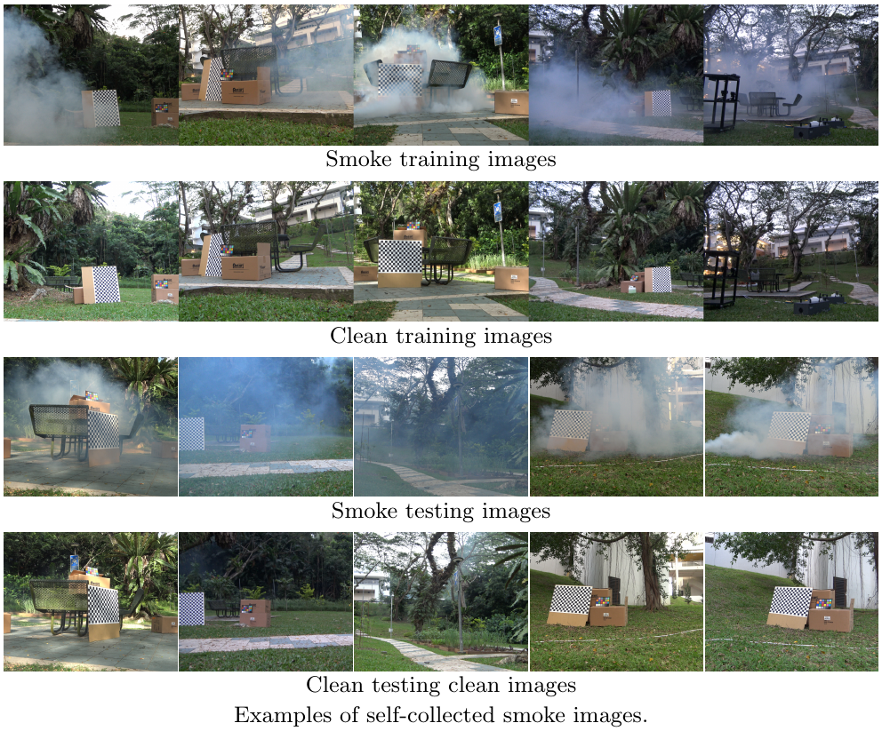
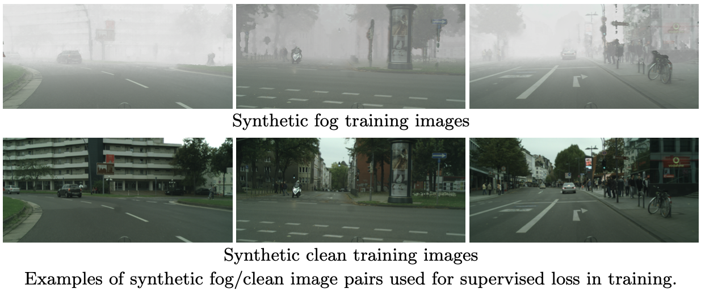

# FogRemoval
## Introduction
## Datasets
### 1. [SMOKE Dataset](https://www.dropbox.com/sh/g30b8n308ftbrcl/AAA69OSu5DnOGyiyt9cG4pmma?dl=0)
```
${FogRemoval}
|-- Dataset_day
    |-- [Smoke](https://www.dropbox.com/home/badweather/ACCV2022_defog/Dataset_day/Smoke)
      |-- train (110 pairs)
         |-- hazy  
         |-- clean
      |-- [test] (12 pairs) 
         |-- hazy  
         |-- clean  
```
<p align="left">
  
</p>

[[SMOKE Train]](https://www.dropbox.com/sh/wg38snebqnw18l4/AAArLgzWBoA6Zf_Nhzn5elgRa?dl=0)
[[SMOKE Test]](https://www.dropbox.com/sh/idkg762ni884gpi/AACBfFJMepnNzW0J2N-e_Upja?dl=0)
[[Ours Results]](https://www.dropbox.com/sh/d1xpyqav1uoqcfy/AABAgO6MoohQ8yV02aRZmU66a?dl=0)

[[Dense-HAZE]](https://www.dropbox.com/sh/zo6sycm9gp9g5s7/AACJlDps7DkMn4fit-_MgDC8a?dl=0)
[[NH-HAZE]](https://www.dropbox.com/sh/udnkp537pdw6kku/AACqvsPUW_JmEI_kVCNkIVuQa?dl=0)
[[O-HAZE]](https://www.dropbox.com/sh/lzuhwrw4gm5nb8j/AACImJSX02Beck8-T9Sy2Nega?dl=0)

## Pre-trained Model
Download the [pre-trained NH-HAZE model](https://www.dropbox.com/s/a1znnuhi0tmoown/NH-HAZE_params_0100000.pt?dl=0), put in `results/NH-HAZE/model/NH-HAZE_params_0100000.pt`

## Test
```
python main_test.py --datasetpath [path_to_NH-HAZE dataset]
```

### 2. [Fog Cityscapes](https://www.dropbox.com/sh/mc5ffqsnt4v51tb/AAA34D0md0arAtabonmVVn0Oa?dl=0)
```
${FogRemoval}
|-- Dataset_day
    |-- Cityscapes
      |-- disparity 
      |-- leftImg8bit 
      |-- train (2,975 pairs)
         |-- hazy
         |-- clean 
      |-- test (1,525 pairs)
         |-- hazy  
         |-- clean 
      |-- generate_haze_cityscapes.m
```
      
Run the Matlab code to generate Synthetic Fog Cityscapes pairs:
```
Cityscapes/generate_haze_cityscapes.m
```
<p align="left">
  
</p>


